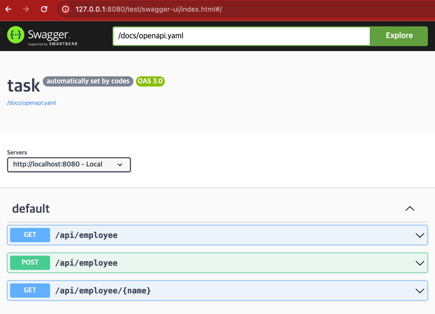

# 구현
## 기술 스택
- Language
    - Java 17
- Framework
    - Spring Boot 3.3.0
- Database
    - JPA/Hibernate
    - H2 database
- Test
    - JUnit5
    - SpringBootTest
- Build
    - Gradle with Kotlin

## 구현 범위
- API 명세 (resources/openapi.yaml 참조)
    - Openapi 스펙 링크: 서버 실행 후 http://127.0.0.1:8080/test/swagger.html 접속하면 아래 화면 접근 가능
      - openapi.yaml 은 https://github.com/keeka2/task_20240618/blob/main/src/main/resources/openapi.yaml 에서 확인 가능
    - 
- API 구현
    - GET /api/employee
        - employee 조회
        - 기본 페이징 처리 (페이지당 20개 / page 쿼리 파라미터 값 없을시 1로 시작)
    - POST /api/employee
        - 테스트 데이터 생성
        - csv, json 파일 업로드
        - csv, json body 업로드 
    - GET /api/employee/{name}
        - employee 이름으로 조회
        - name 은 DB 에 unique 로 설정
- 테스트 코드
    - Controller, Service, Util 등의 테스트 코드 작성
# 코드 빌드, 실행 방법
## 코드 빌드 및 서버 실행 방법 (Docker)
```sh
docker build -t jsk-test -f docker/Dockerfile .
docker run -p 8080:8080 jsk-test
```

# 테스트 방법
- 위의 스웨거 페이지에서 Try It Out 통해 API 테스트 가능

특이사항
- csv, json body 업로드: text/plain 선택
- csv, json 파일 업로드: application/octet-stream 선택 (스웨거에서는 파일 불러와서 보낼때 약간 느려 아래 같은 curl 사용 가능)
```sh
curl 'http://localhost:8080/api/employee' \
-X 'POST' \
-H 'Content-Type: application/octet-stream' \
--data-binary '@{파일 경로}'
```
